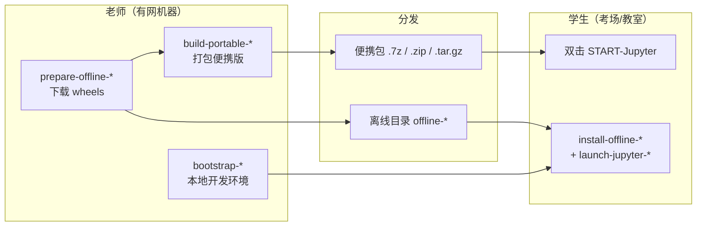

# Jupyter 考试环境（Python 3.8.10）

**一键部署、完全隔离的 Jupyter Notebook 考试/教学环境** — 面向没有预装 Python 的 Windows 与 macOS 机器，支持在线安装、离线安装，以及学生端零配置便携包。

老师在有网环境构建一次，学生解压后双击即可启动；支持联网、完全离线、以及自包含便携包三种分发方式。

---

## 一眼看懂

| 你是谁 | 你要做什么 | 怎么做 |
|--------|-----------|--------|
| **学生** | 打开 Jupyter 做题 | 解压老师发的便携包 → 双击 `START-Jupyter.bat`（Windows）或 `START-Jupyter.command`（macOS） |
| **老师（有网）** | 在本机搭建开发环境 | 见下方 [开发环境快速开始](#开发环境快速开始) |
| **老师（考场无网）** | 制作离线安装包或便携包 | 有网机器运行 `prepare-offline-*` → 拷贝到考场 → 运行 `install-offline-*` 或直接发便携包 |
| **老师（没有 Mac）** | 构建 macOS 便携包 | GitHub Actions → 运行「Build portable macOS bundle」工作流 → 下载构建产物 |

### 核心特性

- **Python 3.8.10 锁定** — 启动前强制校验版本，避免环境漂移
- **环境完全隔离** — 使用项目内 `.venv38` 或 `runtime/python`，忽略系统 Python、`PYTHONPATH`、`PYTHONHOME`
- **依赖版本锁定** — 数据科学 + 机器学习全家桶（pandas、sklearn、xgboost、opencv、onnx 等）
- **双 Windows 产品线** — Win10/11 主线 + Win7 兼容旧版栈
- **真正离线** — `pip` 全程 `--no-index`，不访问 PyPI
- **便携包零配置** — 解压即用，适合 U 盘分发
- **持续集成冒烟测试** — macOS 便携包构建后自动验证依赖导入与 HTTP 探活

### 支持平台

| 平台 | 开发环境 | 便携包 | 离线安装 |
|------|---------|--------|---------|
| Windows 10/11 | ✅ | ✅ `win10plus` | ✅ |
| Windows 7（尽力兼容） | ✅ | ✅ `win7-legacy` | ✅ |
| macOS arm64 | ✅ | ✅ | ✅ |
| macOS x86_64 | ✅ | ✅（需 Intel Mac 本地构建） | ✅ |

### 预装依赖（Win10/11 主线）

`requirements-py38-win10plus.txt` — Jupyter 7 + 常用数据科学与机器学习库：

`notebook` · `pandas` · `numpy` · `matplotlib` · `seaborn` · `scikit-learn` · `imbalanced-learn` · `xgboost` · `opencv-python` · `onnx` / `onnxruntime` · `openpyxl` · `xlrd` · 等

Win7 旧版依赖栈见 `requirements-py38-win7-legacy.txt`（Notebook 6、较旧版本的 numpy/sklearn 等）。

---

## 工作流程



---

## 项目结构

```
Jupyter_Env_For_Exam/
├── bootstrap-windows.ps1 / bootstrap-macos.sh     # 在线：创建 .venv38 开发环境
├── launch-jupyter-windows.bat                   # 启动 Jupyter（推荐入口）
├── launch-jupyter-macos.command
├── prepare-offline-windows.ps1                  # 在线：下载离线 wheels
├── prepare-offline-macos.sh
├── install-offline-windows.ps1                  # 离线：从 wheels 安装
├── install-offline-macos.sh
├── build-portable-windows.ps1                   # 打包 Windows 便携版
├── build-portable-macos.sh
├── verify-env-windows.ps1 / verify-env-macos.sh # 校验 Python 版本与依赖
├── requirements-py38-win10plus.txt              # Win10/11 依赖清单
├── requirements-py38-win7-legacy.txt            # Win7 兼容依赖清单
├── requirements-py38.txt                        # macOS / 通用开发环境
├── offline-windows/                             # Windows 离线缓存（git 忽略 wheels）
├── offline-macos/                               # macOS 离线缓存
├── dist/                                        # 便携包输出（git 忽略）
└── .github/workflows/build-portable-macos.yml   # 无 Mac 时通过 CI 构建
```

便携包内学生看到的结构：

```
JupyterExam-Portable-py38-*/
├── START-Jupyter.bat / START-Jupyter.command   # 学生入口
├── README.txt                                   # 简要使用说明
└── runtime/
    ├── python/          # 内置 Python 3.8.10
    ├── notebooks/       # 默认工作目录
    └── ...
```

---

## 开发环境快速开始

适合老师在开发机上调试 notebook。使用 [`uv`](https://github.com/astral-sh/uv) 自动安装 Python 3.8.10。

### Windows

```powershell
Set-ExecutionPolicy -Scope Process Bypass
.\bootstrap-windows.ps1
.\launch-jupyter-windows.bat
```

也可直接双击 `launch-jupyter-windows.bat`。

首次运行会在项目根目录创建 `logs\` 文件夹：
- `logs\launcher.log` — 启动步骤与错误信息
- `logs\jupyter.log` — Jupyter 服务标准输出/错误

### macOS

```bash
chmod +x bootstrap-macos.sh launch-jupyter-macos.command
./bootstrap-macos.sh
./launch-jupyter-macos.command
```

也可双击 `launch-jupyter-macos.command`（需先 `chmod +x`）。

日志路径：`logs/launcher.log` 与 `logs/jupyter.log`（首次运行自动创建）。

---

## 便携包（学生零配置）

解压后双击启动，无需安装 Python。所有运行时文件位于 `runtime/` 目录下。

### Windows 构建（老师机器，PowerShell）

**Win10/11 主线：**

```powershell
.\prepare-offline-windows.ps1 -Profile win10plus
Set-ExecutionPolicy -Scope Process Bypass; .\build-portable-windows.ps1 -Profile win10plus
```

输出目录：`dist\JupyterExam-Portable-py38-win10plus\`  
若已安装 [7-Zip](https://www.7-zip.org/)，同时生成 `.7z`；否则生成 `.zip`。

**Win7 兼容线：**

```powershell
.\prepare-offline-windows.ps1 -Profile win7-legacy
Set-ExecutionPolicy -Scope Process Bypass; .\build-portable-windows.ps1 -Profile win7-legacy
```

输出目录：`dist\JupyterExam-Portable-py38-win7-legacy\`，压缩格式同上。

若本机已注册 Python 3.8，安装器可能跳过；脚本会复制已有的 **3.8.10** 目录。也可手动指定：

```powershell
$env:PREBUILT_PYTHON38 = 'D:\path\to\python38root'
.\build-portable-windows.ps1
```

源目录须包含 `python.exe`，且版本为 **3.8.10**。

### macOS 构建（需真实 Mac）

```bash
chmod +x prepare-offline-macos.sh build-portable-macos.sh
./prepare-offline-macos.sh    # 推荐：预下载 wheels
./build-portable-macos.sh
```

分别在 **arm64** 与 **x86_64** Mac 上构建对应架构的便携包。脚本通过 `uv python install 3.8.10` 获取可搬迁的 CPython，再复制到 `runtime/python`。

### 无 Mac：通过 GitHub Actions 构建

将本仓库推送到 GitHub 后，打开 **Actions →「Build portable macOS bundle」→ Run workflow**。

- 默认在 `macos-latest`（Apple Silicon）上构建，上传 `JupyterExam-Portable-py38-mac-arm64.tar.gz` 构建产物
- 可勾选 **Run prepare-offline-macos.sh first**（更慢，但与离线 `offline-macos/wheels` 布局一致）
- Intel（x86_64）包无法在免费 GitHub 运行器上构建，需在 Intel Mac 或付费 x86 runner 上本地构建

工作流文件：`.github/workflows/build-portable-macos.yml`

### 学生使用（离线机器）

| 包类型 | 操作 |
|--------|------|
| Windows win10plus | 解压 → 运行 `START-Jupyter.bat`（启动时校验 Win10/11） |
| Windows win7-legacy | 解压 → 运行 `START-Jupyter.bat`（Win7 尽力兼容） |
| macOS | 解压 → 运行 `START-Jupyter.command`；若被拦截：**系统设置 → 隐私与安全性 → 仍要打开** |

可选自检：`SELFTEST.bat` / `SELFTEST.command`。

---

## 离线安装（目标机器完全无网）

**原则：** 在有网的、与目标机 **同操作系统 + 同 CPU 架构** 的机器上运行 `prepare-offline-*`，再整包拷贝。

离线脚本保证 **pip 绝不联网**：

- 设置 `PIP_NO_INDEX=1`，每次 `pip install` 使用 `--no-index --find-links …/wheels`
- 使用 `--isolated`，忽略用户全局 `pip.ini` 中的索引地址
- wheels 中包含 `pip` 与 `setuptools`，目标机升级 pip 也不需要访问 PyPI

更新离线逻辑后，请重新运行一次 `prepare-offline-windows.ps1` / `prepare-offline-macos.sh`，确保 wheels 目录包含上述包。

### Windows 离线

```powershell
# 1) 有网机器
Set-ExecutionPolicy -Scope Process Bypass
.\prepare-offline-windows.ps1 -Profile win10plus

# 2) 拷贝整个项目文件夹（含 offline-windows）到离线机

# 3) 离线机
Set-ExecutionPolicy -Scope Process Bypass
.\install-offline-windows.ps1 -Profile win10plus
.\launch-jupyter-windows.bat
```

`install-offline-windows.ps1` 可从项目根目录或 `offline-windows/` 内运行。

### macOS 离线

```bash
# 1) 有网机器
chmod +x prepare-offline-macos.sh
./prepare-offline-macos.sh

# 2) 拷贝整个项目文件夹（含 offline-macos）到离线机

# 3) 离线机
chmod +x install-offline-macos.sh launch-jupyter-macos.command
./install-offline-macos.sh
./launch-jupyter-macos.command
```

`install-offline-macos.sh` 可从项目根目录或 `offline-macos/` 内运行。

---

## 环境隔离保证

与机器上已有 Python **完全隔离**：

| 机制 | 说明 |
|------|------|
| 项目内解释器 | Jupyter 始终使用 `.venv38` 或便携包 `runtime/python` |
| 版本门禁 | 启动前断言 Python **恰好为 3.8.10** |
| `-E -s` 启动参数 | 忽略外部 `PYTHON*` 环境变量与用户 site-packages |
| 清空污染变量 | 启动脚本清除 `PYTHONHOME`、`PYTHONPATH`，防止系统配置干扰 |

**务必**通过 `launch-jupyter-*.bat` / `launch-jupyter-*.command` 或便携包 `START-Jupyter.*` 启动，不要直接使用系统 `python -m notebook`。

### Jupyter 内核（可选）

在 Jupyter 中选择已注册的内核：

- 显示名称：`Python 3.8 (exam-env)`
- 内核 ID：`py38-exam`

---

## 环境校验

用于确认 Python 版本、依赖版本、内核注册是否正确：

```powershell
# Windows
Set-ExecutionPolicy -Scope Process Bypass
.\verify-env-windows.ps1
```

```bash
# macOS
chmod +x verify-env-macos.sh
./verify-env-macos.sh
```

校验内容：

- Python 版本是否为 **3.8.10**
- 各依赖版本是否与所选 profile 的 requirements 文件一致
- Jupyter 内核是否已正确注册

---

## 依赖配置文件说明

| 文件 | 用途 |
|------|------|
| `requirements-py38-win10plus.txt` | Windows 10/11 便携包与离线 win10plus |
| `requirements-py38-win7-legacy.txt` | Windows 7 兼容便携包与离线 win7-legacy |
| `requirements-py38.txt` | macOS 开发环境与 macOS 便携包 |

`pywinpty` 带有 `sys_platform == "win32"` 环境标记，macOS 上的 pip 不会尝试安装它。

---

## 常见问题

**问：学生双击后没反应？**  
查看便携包或项目根目录下的 `logs/launcher.log`。常见原因：杀毒软件拦截、Python 目录被移动或路径含特殊字符。

**问：macOS 提示「无法打开，因为无法验证开发者」？**  
前往 **系统设置 → 隐私与安全性 → 仍要打开**；或执行 `chmod +x START-Jupyter.command` 后右键打开。

**问：考场是 Windows 7，该用哪个包？**  
使用 `win7-legacy` 产品线（Notebook 6 + 较旧依赖栈），属于尽力兼容，不保证所有功能与 Win10/11 包一致。

**问：如何确认环境没有被系统 Python 污染？**  
运行 `verify-env-*` 脚本，并始终通过官方启动脚本启动 Jupyter，而非系统自带的 `python`。

**问：便携包里的 notebook 默认保存在哪？**  
`runtime/notebooks/` 目录。

---

## 许可与贡献

欢迎提交 Issue 与 Pull Request。具体许可条款见仓库说明。
